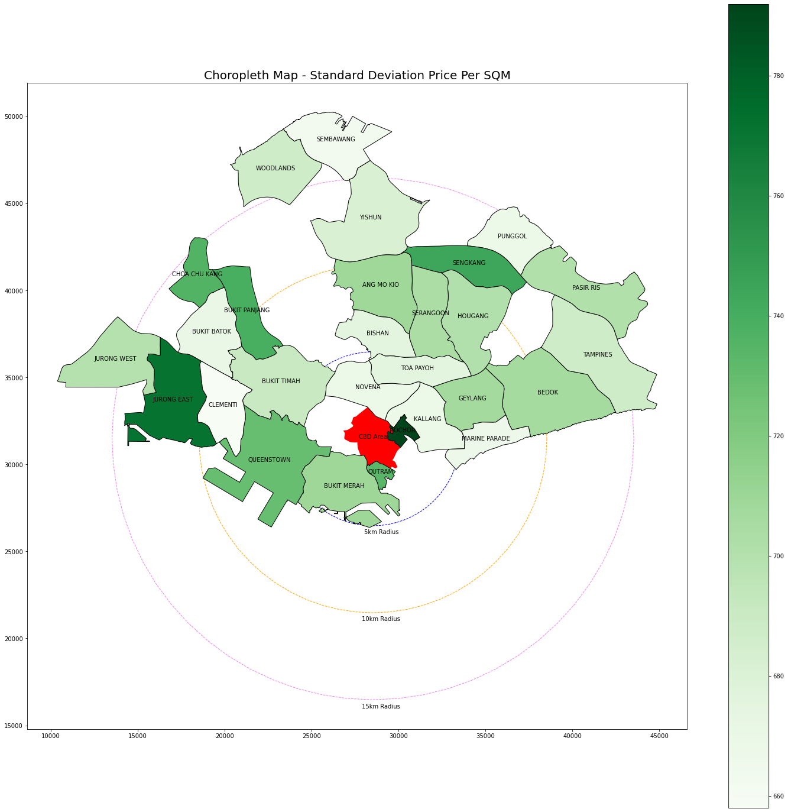
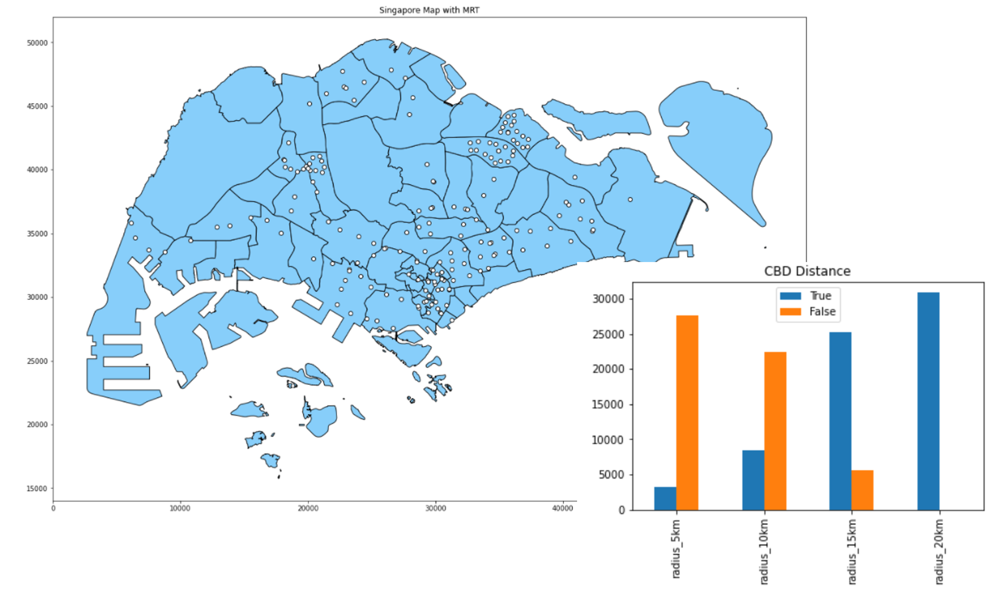
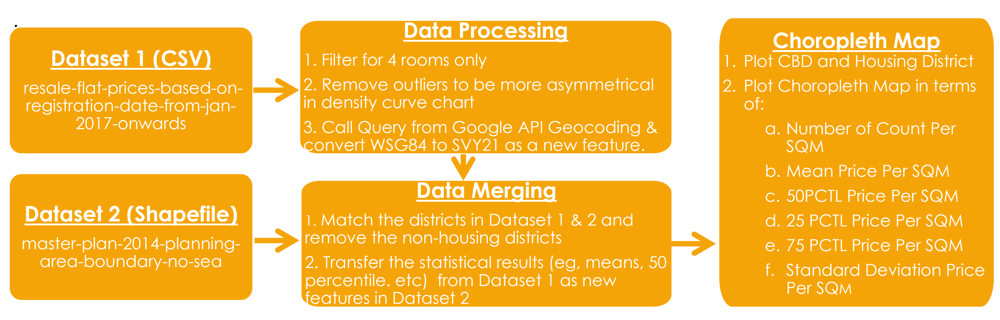
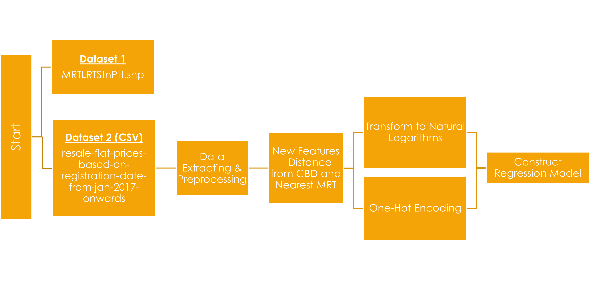

# Mapping and Modeling HDB Resale Prices in Singapore 
This repository comprises two main components:

1. Geospatial Analysis
   
2. Regression Model of the Price based on CBD Radius
   

**Note:** This project was completed in 2021. Feel free to contact me at hjysam@gmail.com if you encounter any errors.

## Methodology

### 1. Geospatial Analysis

### 2. Regression Model 

## 1. Geospatial Analysis

This Jupyter Notebook provides a detailed walkthrough of creating a choropleth map illustrating the price variation for 4-Room HDB resale flats across different areas of Singapore. It also explores the potential association between HDB resale prices and proximity to the Central Business District (CBD).

### Dataset

**Dataset 1: resale-flat-prices-based-on-registration-date-from-jan-2017-onwards**

- Includes resale prices for the last three years, considering them as recent transactions.
- Utilizes Price Per SQM for fair comparison, considering variations in floor area.
- Outliers are removed to simplify Price Per SQM and eliminate market sentiments.
- Utilizes Google API Geocoding to retrieve geometry (Latitude & Longitude).
- Converts WSG84 to SVY21 format for compatibility with Dataset 2.

**Dataset 2: master-plan-2014-planning-area-boundary-no-sea**

- Provided in shapefile format.
- Enables easy plotting on the map of Singapore, depicting district boundaries.
- Latitude and longitude are represented on the vertical and horizontal axes, respectively.

### Steps

1. **Create SVY21 Converter:** Establishes a SVY21 converter to ensure accurate geospatial analysis.

2. **Dataset 1: Extracting and Processing:** Involves extracting and processing HDB resale price data and Singapore Master Plan 2014 Planning Area Boundary data.

3. **Dataset 2: Extracting and Plotting:** Extracts and plots additional relevant dataset(s) such as CBD locations for further analysis.

4. **Merge Datasets:** Merges datasets extracted in previous steps to create a comprehensive dataset for mapping and analysis.

5. **Map Plotting:** Utilizes geospatial visualization tools to create a choropleth map illustrating the variation in prices for 4-Room HDB resale flats across different areas of Singapore. Overlaying relevant data, such as CBD locations, helps analyze the potential association between HDB resale prices and distance to the CBD.

### Conclusion

This analysis offers insights into the spatial distribution of HDB resale prices in Singapore and explores potential relationships between housing prices and proximity to the CBD.

## 2. Regression Model

This project combines geospatial analysis and econometric modeling to gain insights into HDB resale prices in Singapore. It includes creating a choropleth map to visualize price variations across different areas and constructing a regression model to estimate how various factors influence HDB resale prices.

### Dataset

- **Dataset 1:** MRTLRTStnPtt.shp: Plots the MRT locations in Singapore Map.
- **Dataset 2:** Resale-flat-prices-based-on-registration-date-from-jan-2017-onwards: Extracting and processing data.

### Steps

1. **Create SVY21 Converter:** Similar to the previous notebook, this step establishes a SVY21 converter to facilitate accurate geospatial analysis and visualization.

2. **Dataset 1: Extracting and Processing:** Extracts and processes HDB resale price data from the provided data source, serving as the foundation for the regression model.

3. **New Features:** Calculates new features such as distance from the CBD and walking distance from the nearest MRT station, essential for the regression model.

4. **Regression Model:** Constructs a regression model to estimate how various factors, including distance to the CBD, distance to the nearest MRT station, flat size, floor level, and remaining years of lease, influence HDB resale prices.

### Conclusion

By integrating geospatial analysis and econometric modeling, this project provides a comprehensive understanding of HDB resale prices in Singapore. The choropleth map visualizes spatial price variations, while the regression model quantifies the influence of different factors on resale prices.